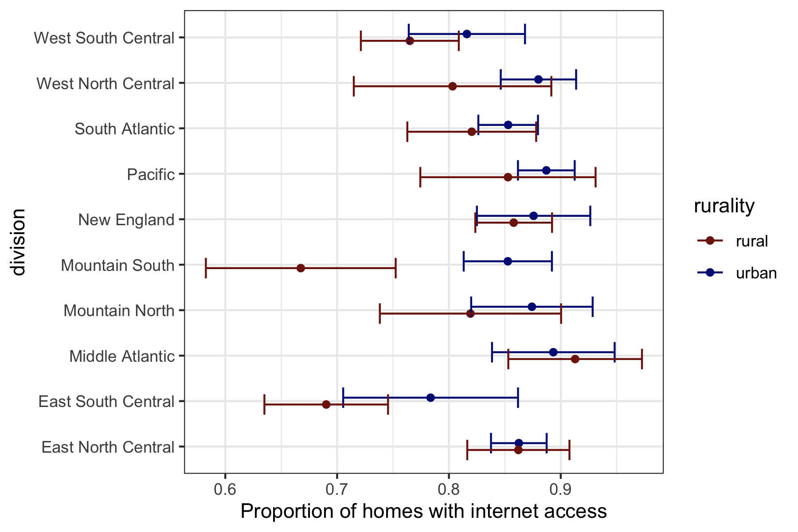

## Stats506_public

## About
[STATS506](https://jbhender.github.io/Stats506/F20/) \
[This Repo](https://github.com/ZhihaoXu/Stats506_public)

## Activity

### Week 1 \
Some basic practice about Linux
### Week 2 \
Some basic opeartion in R
### Week 3 \
[Repo for Zhihao](https://github.com/skorsu/Stats506_public) \
[Repo for Suppapat](https://github.com/skorsu/Stats506_public)

### Week4  
[Repo for Yingyi yang](https://github.com/YingyiYang/Stats506_public)  
[Repo for EunSeon Ahn](https://github.com/EunseonAhn/Stats506_public)  
[Repo for Dongyang Zhao](https://github.com/zhaodyleo/STATS506_F20)

Here is the plot for week4 q1 and q2.

  

  

### Week5
Already finished in the Week4, the code is in [Week4](https://github.com/ZhihaoXu/Stats506_public/tree/master/activities/week4)
